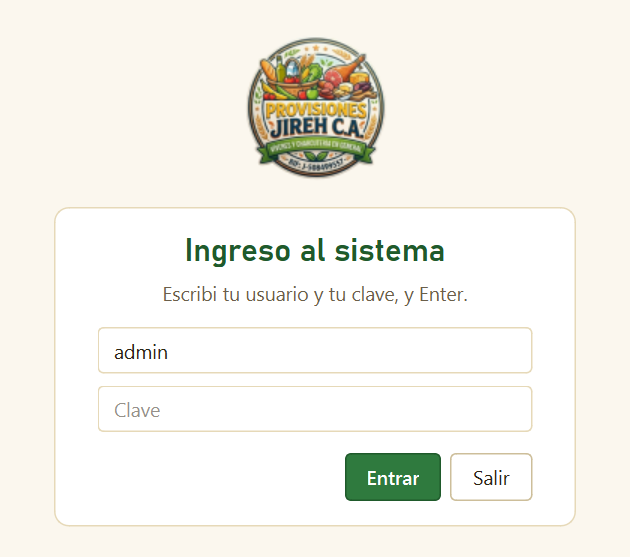
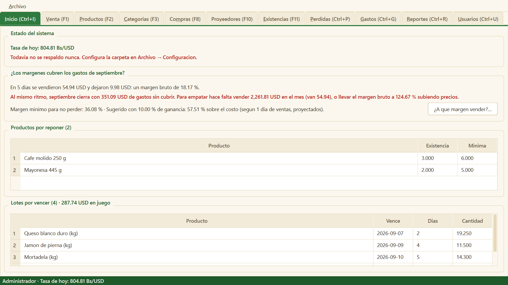
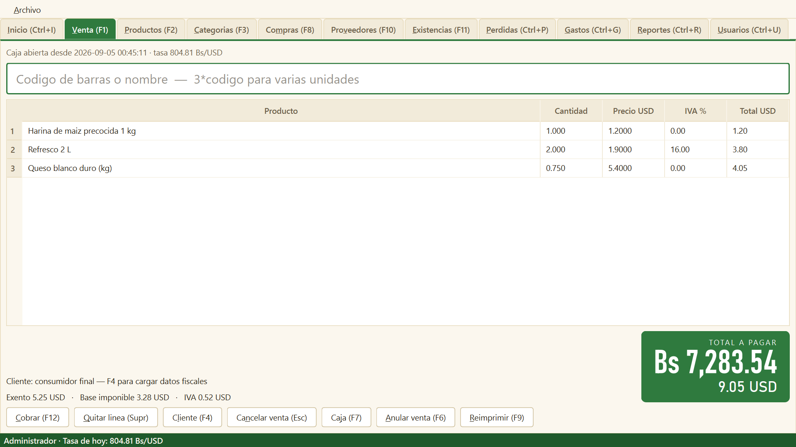
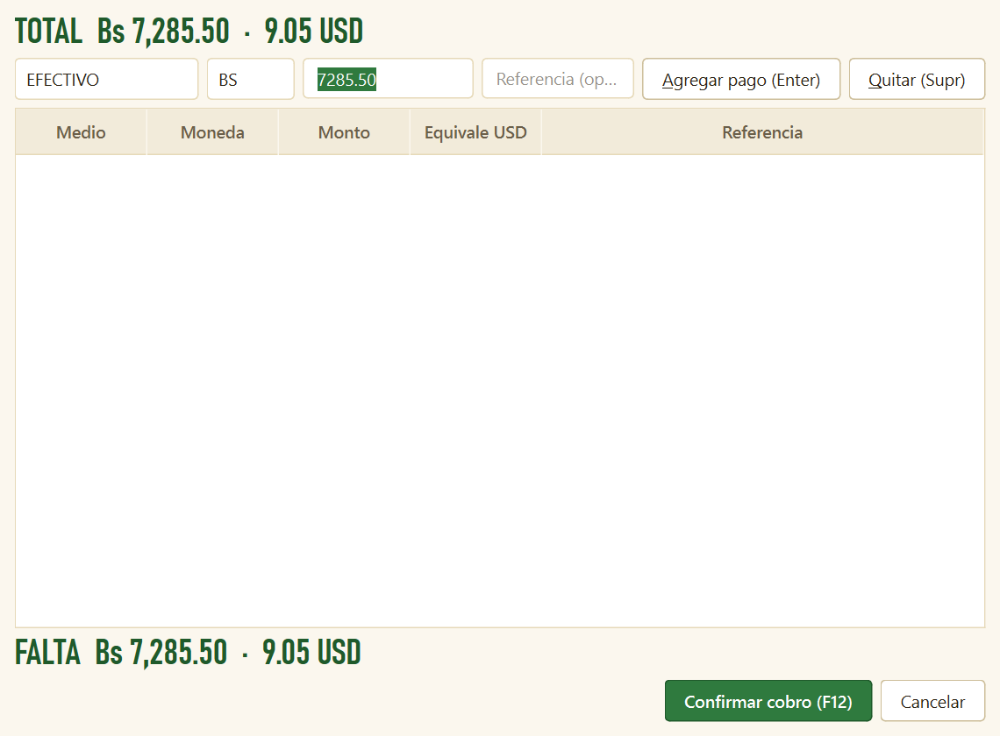
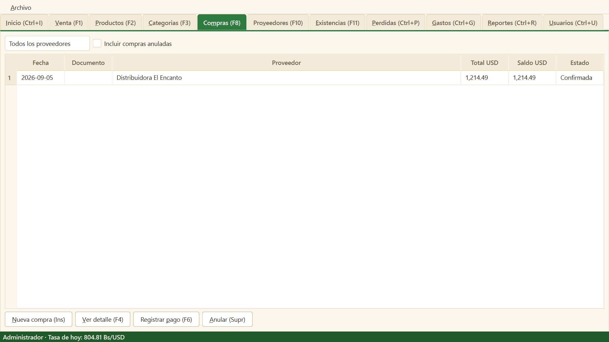
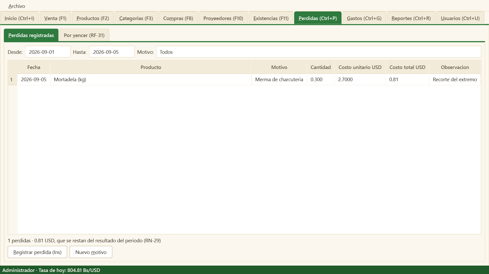
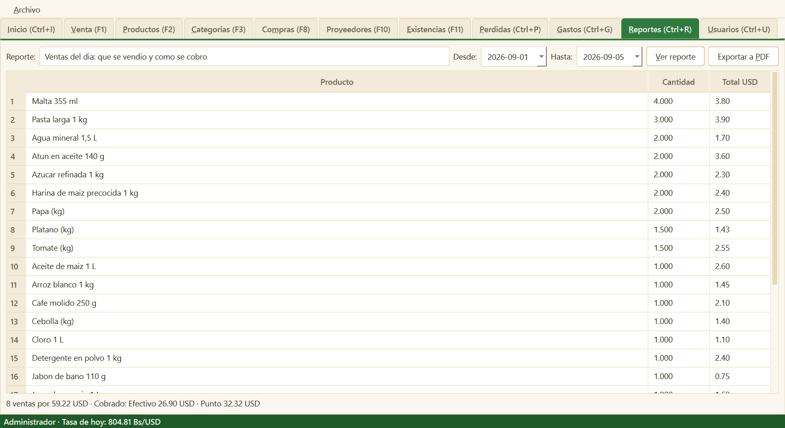
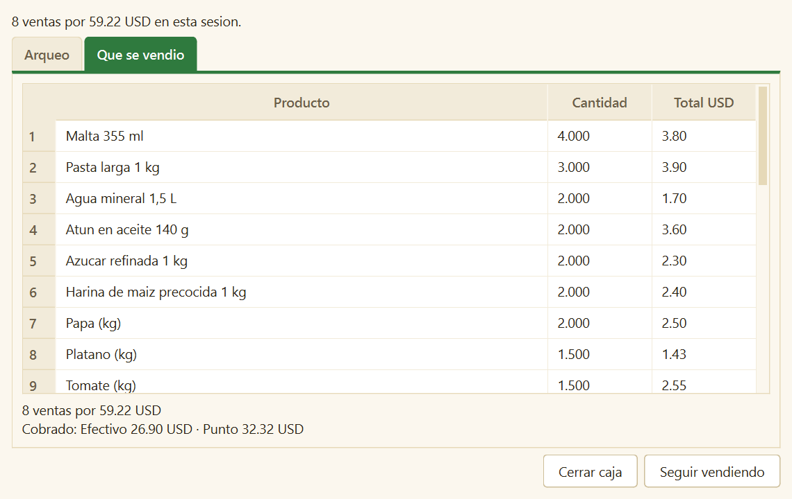
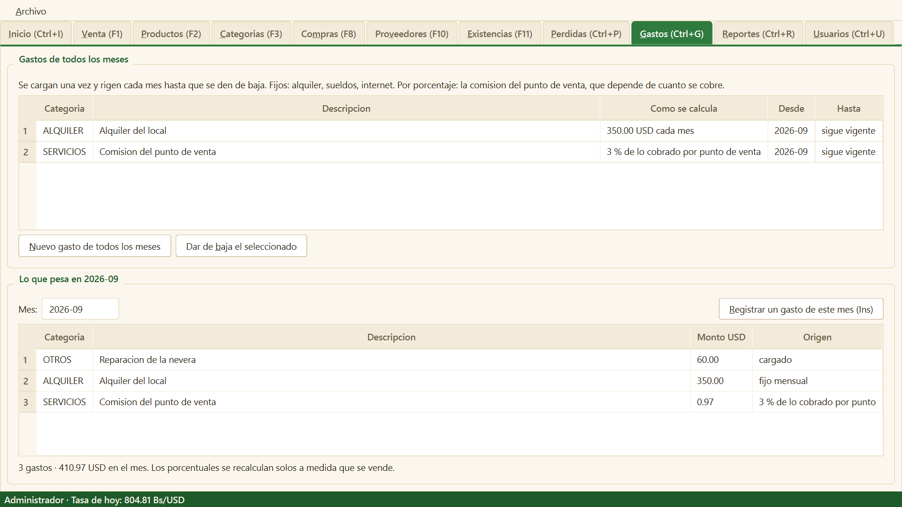
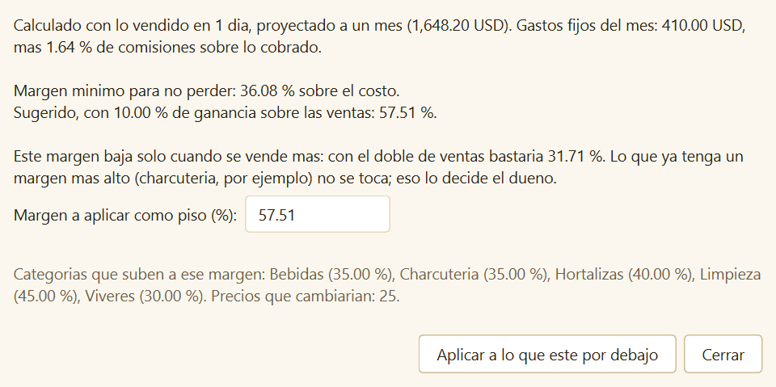

# Manual de usuario

Sistema de gestión para minimarket · Borealis Software Solutions

Este manual cubre las seis tareas del día a día: **vender**, **cerrar la caja**,
**registrar una compra**, **cargar la tasa**, **registrar una pérdida** y
**consultar los reportes**. Las capturas salen de la base de demostración, así
que los números que se ven acá no son los del negocio.

---

## Antes de empezar

### Entrar al sistema

Al abrir el programa se pide usuario y clave. Hay dos perfiles:

| Perfil | Qué puede hacer |
|--------|-----------------|
| **Cajero** | Vender, abrir y cerrar su caja, ver existencias y lo que está por vencer. |
| **Administrador** | Todo lo anterior, más precios, compras, pérdidas, gastos, reportes, usuarios y configuración. |

Las pestañas que el perfil no puede usar no aparecen.

### Moverse con el teclado

La caja se atiende sin mouse. Desde cualquier pantalla:

| Tecla | Va a |
|-------|------|
| `F1` | Venta |
| `F2` | Productos |
| `F3` | Categorías |
| `F5` | Tasa del día |
| `F8` | Compras |
| `F10` | Proveedores |
| `F11` | Existencias |
| `Ctrl+I` | Inicio (alertas) |
| `Ctrl+R` | Reportes |
| `Ctrl+P` | Pérdidas |
| `Ctrl+G` | Gastos |
| `Ctrl+U` | Usuarios |
| `Ctrl+K` | Configuración |
| `Ctrl+Q` | Salir |

### La pantalla de inicio

Lo primero que ve el administrador al entrar: la tasa de hoy, si el respaldo de
ayer salió bien, **si los márgenes cubren los gastos del mes**, qué productos
hay que reponer y qué lotes están por vencer. Si algo aparece en rojo, hay que
atenderlo.

### ¿Los márgenes cubren los gastos?

El panel toma lo vendido en el mes hasta hoy, le resta lo que costó esa
mercadería y las pérdidas, y eso es lo que las ventas *dejaron* (el margen
bruto). Lo proyecta al mes entero al mismo ritmo y lo compara con los gastos
cargados en Gastos.

- **Verde**: al ritmo actual el mes cierra con los gastos pagados y dice cuánto
  queda de ganancia.
- **Rojo**: dice cuánto falta y las dos formas de arreglarlo: cuánto hay que
  vender en el mes, o a qué margen hay que llevar los precios vendiendo lo
  mismo.

Para que el número sirva, los gastos del mes tienen que estar cargados
(sección «Gastos operativos»). Si no lo están, el panel lo avisa.

---

## 1. Cargar la tasa del día

**`F5` · Archivo → Tasa del día**

Sin tasa cargada **no se abre la caja ni se vende**. La tasa de ayer no sirve:
cada día se carga la suya.

1. Presioná `F5`.
2. Apretá **Consultar al BCV** si hay internet. Si el BCV no responde, no pasa
   nada: se escribe el valor a mano en **Tasa de hoy**.
3. **Guardar tasa**. La barra de abajo de la ventana muestra la tasa vigente.

La ventana también lista el histórico de tasas cargadas, con su origen (manual
o BCV).

La tasa se usa para todo lo que se muestra en bolívares. Los precios se guardan
en dólares y se convierten al mostrarlos, así que cargar la tasa correcta es lo
primero de cada mañana.

---

## 2. Vender

**`F1`**

Antes de la primera venta hay que **abrir la caja**: `F7`, el efectivo inicial
en bolívares y en dólares, **Abrir caja**.

### Cargar productos

El cursor está siempre en el campo de arriba. Pasá el lector por el código de
barras y el producto se agrega solo.

- **Varias unidades:** se escribe la cantidad, un asterisco y el código:
  `3*7591001000018`. También sirve para pesos: `0.750*7591002000017`.
- **Sin código de barras:** se escribe parte del nombre y se elige de la lista.
- **El mismo producto dos veces:** se acumula en el renglón que ya existe.
- **Quitar un renglón:** se selecciona y `Supr`.
- **Cancelar toda la venta:** `Esc`.

El panel verde muestra el total a pagar en bolívares —lo que el cliente ve
desde el otro lado del mostrador— y debajo su equivalente en dólares. Se
actualiza en cada tecla.

### Cliente con datos fiscales

`F4` abre los datos del cliente (RIF, razón social) cuando pide factura. Si no,
la venta sale como consumidor final y no hay que tocar nada.

### Cobrar

`F12` abre el cobro:

1. Elegí **medio de pago** (efectivo, débito, transferencia, pago móvil…) y
   **moneda** (Bs o USD).
2. El monto viene sugerido con lo que falta; `Enter` agrega el pago.
3. Se pueden combinar varios pagos: se repite el paso anterior hasta que el
   saldo llegue a cero.
4. `F12` otra vez confirma el cobro.

Si el cliente paga de más, el **vuelto se calcula y se entrega en bolívares**.
La nota de entrega se imprime sola si hay impresora configurada; si la
impresora falla, la venta **igual queda registrada** y se reimprime con `F9`.

> **Anular una venta:** `F6`. Pide el motivo y la clave de un administrador.
> La venta no se borra: queda anulada y la mercadería vuelve al inventario.

---

## 3. Cerrar la caja

**`F7` desde la pantalla de venta, con la caja abierta**

Al final del turno:

1. `F7` abre el arqueo. La tabla muestra lo que el sistema **espera** por cada
   medio de pago y moneda.
2. Contá el efectivo y escribí lo contado en bolívares y en dólares.
3. La diferencia se calcula sola mientras escribís. Solo el efectivo se cuenta:
   los medios electrónicos se concilian después contra el banco.
4. **Cerrar caja**.

El cierre queda guardado con las diferencias. Se puede volver a ver en
Reportes → *Cierre de caja*.

---

## 4. Registrar una compra

**`F8` · solo administrador**

1. `Ins` abre una compra nueva.
2. Elegí el **proveedor** (se dan de alta con `F10`), la fecha y el número de
   documento de la factura.
3. Por cada producto, completá los campos de abajo y apretá **Agregar (F9)**:
   - **Producto**: escribí parte del nombre y elegilo de la lista.
   - **Bultos**: cuántas cajas, paquetes o bultos entraron.
   - **Unid. por bulto**: cuántas unidades trae cada uno.
   - **Costo del bulto**: en dólares, lo que costó el bulto entero.
   - **Vence**: fecha `AAAA-MM-DD`, solo si el producto maneja vencimiento.
     Crea el lote.

   Ejemplo: 3 cajas de refresco de 12 botellas a 15 USD la caja → `3`, `12`,
   `15`. El sistema calcula solo 36 unidades a 1,25 USD cada una. Si la
   compra viene suelta (un jamón de 4,2 kg), va `1` bulto de `4.2` unidades.
   No hay que dividir nada a mano.
4. **Confirmar compra**. La mercadería entra al inventario y el costo queda
   registrado.

### El sistema dice qué precio poner

Cada producto tiene un **margen objetivo** (el suyo o el de su categoría). Al
confirmar la compra, el sistema toma el costo que se acaba de pagar —el de
*este* proveedor, en *esta* compra— y revisa si el precio de venta actual
todavía deja ese margen. Si alguno quedó corto, muestra la lista con el precio
que hoy tiene, el margen que deja y el **precio sugerido**, y ofrece **Aplicar
los precios sugeridos** de una vez. Si se elige «Dejar como están», no toca
nada y los precios se revisan después desde Productos.

Los márgenes objetivo se fijan en Categorías (`F3`) para toda la categoría, o
en Productos (`F2`) para uno en particular. El sistema no inventa el margen:
calcula el precio que lo cumple con el costo real de la última compra.

> **Anular una compra:** `Supr`. No se puede si ya se pagó o si parte de esa
> mercadería ya se vendió; en ese caso la corrección es un ajuste o una pérdida.

> **Pagar al proveedor:** `F6` sobre la compra registra el pago.

---

## 5. Registrar una pérdida

**`Ctrl+P` · solo administrador**

Todo lo que sale del inventario sin venderse se registra acá: vencido, roto,
faltante, merma de charcutería o consumo propio.

1. `Ins` abre el registro.
2. Elegí el producto, la cantidad y el motivo. La observación es opcional.
3. Guardá.

La pérdida se valoriza con el costo de la última compra **anterior a esa
fecha**, descuenta la existencia y se resta del resultado del período.

### Lo que está por vencer

La pestaña **Por vencer** lista los lotes dentro de sus días de aviso.
Seleccionando un lote y apretando `Supr` se lo da de baja directamente como
pérdida por vencimiento, sin tener que cargar la cantidad a mano.

---

## 6. Consultar los reportes

**`Ctrl+R` · solo administrador (el cajero ve el cierre de su caja)**

1. Elegí el reporte de la lista.
2. Ajustá **Desde** y **Hasta** (para «Ventas del día», solo la fecha).
3. **Ver reporte**.
4. **Exportar a PDF** guarda lo que se ve en pantalla, con el encabezado y el
   logo del negocio.

| Reporte | Para qué sirve |
|---------|----------------|
| Ventas del día | Qué se vendió de cada producto y cuánto entró por cada medio: «tantas harinas, 23 USD por pago móvil». |
| Ventas del período | Cuánto se cobró, por medio de pago y moneda. |
| Cierre de caja | El arqueo de una sesión, con sus diferencias. |
| Ganancia por producto | Qué deja cada producto. |
| Ganancia por categoría | Lo mismo, agrupado. |
| Resultado del período | Ventas menos costo, pérdidas y gastos del mes: lo que quedó. |
| Inventario valorizado | Cuánta plata hay parada en mercadería. |
| Próximos a vencer | Lo que hay que sacar antes de perderlo. |
| Pérdidas por motivo | Por dónde se está yendo la mercadería. |
| Libro de ventas | Formato fiscal, para el contador. |

El mismo resumen de «Ventas del día» aparece al **cerrar la caja**, en la
pestaña **Qué se vendió**, para la sesión que se está cerrando.

### Existencias

**`F11`** muestra la existencia de cada producto, calculada a partir de todos
los movimientos. **No se puede escribir a mano**: si el conteo físico no
coincide, se usa **Ajustar por conteo físico (`F7`)**, que registra la
diferencia como un movimiento más y deja constancia de quién la hizo.

---

## Gastos operativos

**`Ctrl+G` · solo administrador**

Todo lo que se paga aunque no se venda nada, y lo que se paga *por* vender.
Hay dos bloques:

**Gastos de todos los meses.** Se cargan una vez y rigen cada mes hasta que
se den de baja. Son de dos tipos:

- **Fijos**: un monto por mes. Alquiler, sueldos, internet, luz.
- **Por porcentaje**: una parte de lo que se cobra. La comisión del punto de
  venta (por ejemplo 3 % de lo cobrado por punto) o del pago móvil. El
  sistema la calcula solo cada mes según lo que realmente se cobró por ese
  medio.

Para dar de baja uno (se mudaron, cambió el banco), se selecciona y **Dar de
baja**: cuenta hasta el mes actual y deja de regir desde el siguiente. No se
borra: los meses pasados lo siguen mostrando.

**Lo que pesa en el mes.** Abajo se ve el mes completo: los gastos de todos
los meses ya valuados, más los que se cargan sueltos con **Registrar un gasto
de este mes** (una reparación, una multa: lo que no se repite).

Los gastos van por mes: el alquiler de septiembre es de septiembre aunque se
pague en octubre. Se restan enteros del resultado del mes; no se reparten
entre productos.

---

## ¿A qué margen vender?

**Inicio → «¿A qué margen vender?…», o Productos → el mismo botón · solo
administrador**

Para un negocio nuevo la pregunta es esa: ¿cuánto le cargo a la mercadería
para pagar los gastos y ganar, sin quedar caro? El sistema la responde con
una cuenta, no con una opinión:

1. Toma lo que se vende por mes (los últimos 30 días; si el negocio es más
   nuevo, proyecta los días que lleva; si todavía no vendió, usa las **ventas
   esperadas** que se cargan en Configuración).
2. Toma los gastos fijos del mes y las comisiones por porcentaje.
3. Calcula el **margen mínimo para no perder** (el piso) y el **sugerido**,
   que es el piso más la ganancia deseada (10 % de las ventas por defecto; se
   cambia en Configuración).

Los dos números son **sobre el costo**, igual que el margen objetivo de
categorías y productos: un margen de 40 % significa que algo que costó 1,00
se vende a 1,40 más IVA.

### Por qué baja solo cuando venden más

El alquiler es el mismo si venden 2.000 o 6.000 al mes. Con 2.000, cada
dólar vendido tiene que aportar mucho para pagarlo; con 6.000, poco. Por eso
el sistema muestra «con el doble de ventas bastaría X %»: a medida que el
negocio crece, el margen necesario baja y el sistema lo va diciendo. Y cuando
compran más cantidad y el proveedor les cobra menos, el precio baja solo con
el mismo margen, porque el precio se calcula sobre el último costo.

### Aplicarlo a todo lo que ya tienen

El botón **Aplicar a lo que esté por debajo** sube al margen elegido toda
categoría o producto que hoy tenga un margen objetivo menor, y recalcula los
precios de todo el catálogo con el último costo de compra. **Lo que ya tenía
un margen más alto no se toca**: si el dueño le puso 45 % a limpieza porque
sabe que ahí se puede, eso queda. Antes de aplicar se ve la lista de precios
que cambiarían, y el margen es editable.

Lo que el sistema **no** sabe es qué producto tiene que ir más barato para
competir con el negocio de la esquina. Eso lo sabe el dueño, y el lugar para
decirlo es el margen objetivo de cada categoría (`F3`) o de cada producto
(`F2`). El sugerido es el piso; de ahí para arriba, cada uno decide.

### En Productos

La columna **Margen %** muestra qué margen deja hoy el precio de cada
producto con su último costo. **En rojo** los que están por debajo del piso:
esos se venden a pérdida una vez pagados los gastos. **Recalcular todos los
precios** vuelve a calcular todo el catálogo con los márgenes objetivo
actuales, sin cambiar los márgenes.

---

## Respaldo

El respaldo se ejecuta solo, una vez por día, a partir de la hora configurada.
Necesita que la carpeta de destino —normalmente un pendrive o un disco
externo— esté configurada en **Archivo → Configuración** y conectada.

Si el respaldo del día falló, el administrador lo ve avisado al entrar y en la
pantalla de inicio. Desde Configuración se puede respaldar a mano en cualquier
momento y también restaurar un respaldo anterior.

> **Restaurar reemplaza todo lo que la base tenga ahora.** Se usa solo cuando
> hay que volver atrás por una falla, y conviene respaldar antes de restaurar.

---

## Cargar el catálogo desde un archivo

**Archivo → Importar catálogo desde CSV · solo administrador**

Para la carga inicial de cientos de productos:

1. **Archivo → Guardar plantilla de catálogo…** deja un `catalogo.csv` con las
   columnas correctas y una fila de ejemplo.
2. Se completa en Excel y se guarda como **CSV UTF-8 (delimitado por comas)**.
3. **Archivo → Importar catálogo desde CSV…**

Las columnas son:

| Columna | Obligatoria | Notas |
|---------|-------------|-------|
| `nombre` | sí | |
| `categoria` | sí | Tiene que existir. Se crean antes con `F3`. |
| `alicuota` | sí | `EXENTO`, `GENERAL` o `REDUCIDA`. |
| `precio_venta_usd` | sí | Con IVA incluido. Acepta coma o punto. |
| `codigo_barras` | no | |
| `margen_objetivo` | no | Vacío: se usa el de la categoría. |
| `existencia_minima` | no | |
| `maneja_vencimiento` | no | `si` o vacío. |
| `dias_alerta_venc` | no | Por defecto 15. |

Si alguna fila tiene un problema, **no se carga ninguna**: aparece la lista de
filas con su error, se corrige el archivo y se vuelve a importar. Así no queda
medio catálogo cargado ni productos duplicados en el segundo intento.

---

## Si algo sale mal

Los errores quedan anotados en `minimarket.log`, en la misma carpeta que la
base de datos (`Minimarket` dentro de la carpeta del usuario). Ese archivo es
lo que hay que mandar al soporte técnico cuando se reporta un problema.
